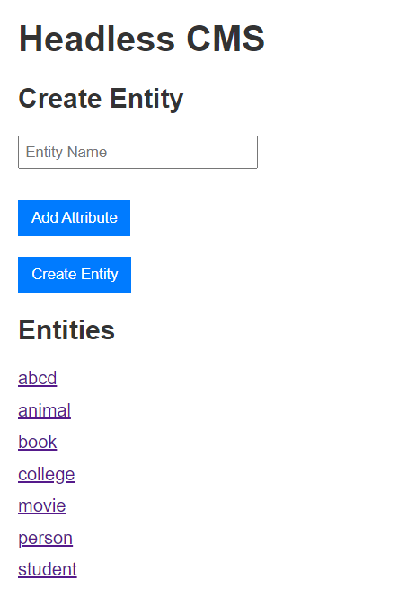
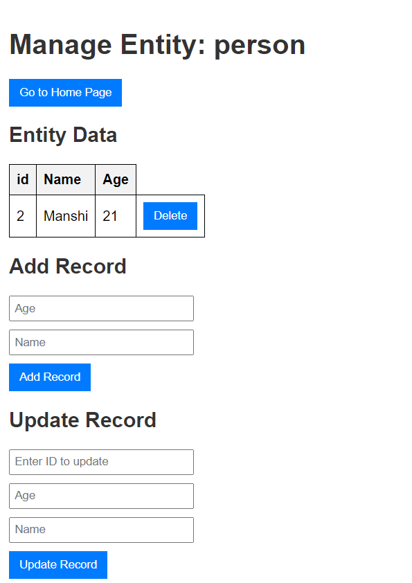

### Basic Headless CMS

## Setup:

# Prerequisites
1. Node.js and npm installed.
2. MySQL installed and running.

# Set up the MySQL Database
```
CREATE DATABASE test;
```

Change these lines in the db.js file according to your db server:

host: 'localhost', //change according to you server host for db
user: 'root', //change use
password: 'abcd', //change password

**_NOTE:_** Please keep the database name test

# Install necessary dependencies:
```
npm install express mysql2 body-parser
```
or
```
npm install
```

# Run the Application
1. Start the MySQL server if it's not running.
2. Run the Node.js server:
```
node index.js
```
3. Open your browser and navigate to http://localhost:3000.

## Usage:
# Home page:

1. Create an entity by providing the entity name and attributes where you can choose the type for each attributes.
2. There is a list of entities which shows all the entities name created till yet. You can go to that entity page by clicking on the name.

# Entity page:

1. You can see all the records of this entity in a table format.
2. Each row has also a delete option which on click will delete that record from that entity.
3. You can add a new record or update an existing one by using ID of that record.

There are many base case and error case are handdled which you can see by exploring it.